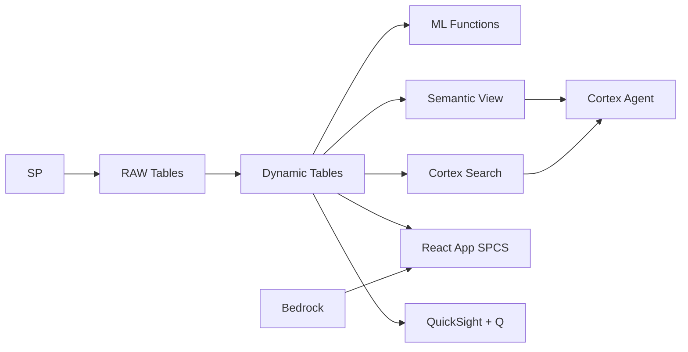

# Contact Center Intelligence & CSAT Optimization

Philippine BPO agents handle 2.3M calls daily — Snowflake ingests Amazon Connect interactions, classifies intent, scores sentiment in real-time, and surfaces CSAT drivers before client SLAs breach.

## Architecture

A Philippine BPO giant operates 12 contact centers handling 620,000 interactions monthly for 35 enterprise clients. Five accounts worth ₱890M in annual contracts are below CSAT SLA targets — but with interactions split across voice, chat, and email, nobody could pinpoint the root cause until now. Amazon Connect captures every interaction; Snowflake's AI classifies, scores, and surfaces the patterns.



## Snowflake Capabilities

| Capability | Implementation |
|-----------|---------------|
| Dynamic Tables | ACCOUNT_HEALTH_SCORE / AGENT_SENTIMENT_SCORES / INTERACTION_ENRICHED / COMPLAINT_PARETO |
| ML Functions | ML.CLASSIFICATION + ML.FORECAST |
| Cortex AI | AI_CLASSIFY, AI_SENTIMENT, COMPLETE |
| Cortex Search | 450000 documents indexed |
| Cortex Agent | CONTACT_CENTER_AGENT |
| Semantic View | CONTACT_CENTER_ANALYTICS |
| React App (SPCS) | 5 tabs + DemoGuide |


## AWS Services

| Service | Role in Demo |
|---------|-------------|
| Amazon Connect | Cloud contact center platform ingesting calls/chats/emails |
| Amazon Transcribe | Speech-to-text for call recordings |
| Amazon Comprehend | Sentiment analysis and entity extraction from transcripts |
| Amazon Bedrock (Claude) | Generate coaching summaries and interaction insights |
| Amazon QuickSight + Q | Contact center analytics dashboard |
| Amazon EventBridge | Event-driven alerts for SLA breaches |


## Personas

| Persona | Role | Key Questions |
|---------|------|---------------|
| **Patricia Angela Villanueva** | VP Client Services | "Which accounts are below CSAT target?" "What's our overall NPS trend this month?" |
| **Rafael Miguel Chua** | Quality Assurance Lead | "Which agents need coaching based on sentiment scores?" "What are the top complaint categories this week?" |


## Data

| Table | Rows | Description |
|-------|------|-------------|
| ACCOUNTS | 35 | Client accounts served (US/UK/AU enterprise clients) |
| AGENTS | 8,500 | Contact center agents across 12 sites |
| INTERACTIONS | 620,000 | 30 days of call/chat/email interactions from Amazon Connect |
| TRANSCRIPTS | 450,000 | Call transcripts from Amazon Transcribe |
| CSAT_SURVEYS | 185,000 | Post-interaction customer satisfaction surveys |
| SLA_DEFINITIONS | 35 | Per-account SLA thresholds (AHT, FCR, CSAT, ASA) |
| QUALITY_AUDITS | 42,000 | Manual QA scores and coaching notes |


## Build Instructions

### Prerequisites
- Snowflake account with ACCOUNTADMIN access
- Cortex AI enabled (ML Functions, Search, Agent)
- Warehouse: CC_WH (Medium)
- AWS CLI with access (us-west-2)

### Deployment

```bash
snowsql -f snowflake/00_setup.sql
snowsql -f snowflake/01_marketplace_install.sql
snowsql -f snowflake/02_raw_tables.sql
snowsql -f snowflake/03_staging.sql
snowsql -f snowflake/04_dynamic_tables.sql
snowsql -f snowflake/05_search.sql
snowsql -f snowflake/06_ml_models.sql
snowsql -f snowflake/07_semantic_view.sql
snowsql -f snowflake/08_agent.sql
```

### React App (SPCS)
```bash
cd app && npm ci && npm run build
docker build -t aws-philippines-bpo-contact-center-app .
docker push bdiqc8sm-default.registry.snowflakecomputing.com/contact_center_ai/app/aws_philippines_bpo_contact_center/app:latest
```

### Demo Mode
Open the app URL with `?demo=true` for presenter view.

## Build Modes

### Snowflake Only
Run scripts 00-08 (skip AWS-specific integration). Uses:
- **Snowpipe Streaming (ingest)** instead of Amazon Connect
- **Pre-processed transcripts via Snowpipe** instead of Amazon Transcribe
- **AI_SENTIMENT + AI_CLASSIFY (native)** instead of Amazon Comprehend
- **Cortex Complete** instead of Amazon Bedrock (Claude)
- **Snowflake Intelligence (Cortex Analyst)** instead of Amazon QuickSight + Q
- **Alerts + Notification Integration** instead of Amazon EventBridge

### Full AWS + Snowflake
Run all scripts including AWS integration. Deploy QuickSight dashboard from `quicksight/`.

## Business Impact

Industry research and Snowflake customer outcomes:
- **Philippines handles 70% of global voice BPO outsourcing** — [IBPAP](https://ibpap.org/industry-facts-and-figures)
- **AI-powered quality monitoring improves CSAT 15-25% in contact centers** — [Gartner](https://www.gartner.com/en/customer-service-support/trends/customer-service-technology)
- **Real-time sentiment analysis reduces escalations by 30%** — [Forrester](https://www.forrester.com/research/customer-experience/)
- **Contact center AI market projected to reach $4.1B by 2027** — [MarketsandMarkets](https://www.marketsandmarkets.com/Market-Reports/contact-center-ai-market)


## Key Demo Numbers

- **620,000** monthly interactions processed across 35 accounts
- **5 accounts** below CSAT SLA target (₱890M contract value at risk)
- **450,000** transcripts scored by AI_SENTIMENT
- **23%** of interactions scored negative sentiment
- **142 agents** identified for AI-generated coaching plans
- **18% CSAT improvement** after completing AI-recommended coaching


## License

Apache 2.0 — See [LICENSE](LICENSE) for details.

This is a personal demo project and is not an official Snowflake offering. It comes with no support or warranty.