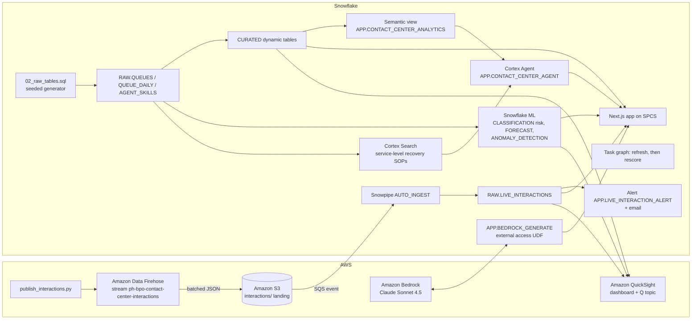

# Philippines BPO Contact Center - Service Levels, Staffing Risk and Intraday Workforce Management

End-to-end contact centre workforce analytics for **48 fictional inbound queues of a fictional Philippine BPO contact centre, served from sites in 6 cities** (Makati City, Taguig, Pasig City, Mandaue City, Cagayan de Oro, Baguio) using Snowflake, optionally with AWS: from a live abandoned contact to a 7-day service-level miss risk score, an alert email and an AI action memo for the workforce management team.

## Architecture

A contact-centre pipeline built on **Snowflake** (Dynamic Tables, Snowflake ML, Cortex Search, Cortex Agent, Cortex AI_COMPLETE, SPCS) and, in the full build, **AWS** (Amazon Data Firehose, S3, Bedrock Claude, QuickSight + Amazon Q). Contact events land in `RAW.LIVE_INTERACTIONS`. Dynamic tables curate 90 days of queue-day history over 32 half-hour intervals per day: contacts offered, agent labor cost, service-level alerts, intervals below service level, overtime call-outs, service level attainment and intraday reforecast compliance. Snowflake ML scores 7-day service-level miss risk per queue, forecasts contact-centre-wide alert volume and flags abandonment rate anomalies. A Cortex Agent answers questions with SOP citations, and an LLM drafts the workforce team's action memo.

Interactive diagrams (hover for object names): [Snowflake only](docs/architecture-snowflake.html) | [AWS + Snowflake](docs/architecture-aws.html). The app shows both on its Architecture & Data tab, the current build first. Regenerate them with `python3 docs/build_architecture.py aws` and `python3 docs/build_architecture.py snowflake`.


```mermaid
flowchart LR
    subgraph AWS
      SIM[publish_interactions.py] --> FH[Amazon Data Firehose<br/>stream ph-bpo-contact-center-interactions]
      FH -->|batched JSON| S3[(Amazon S3<br/>interactions/ landing)]
      BR[Amazon Bedrock<br/>Claude Sonnet 4.5]
      QS[Amazon QuickSight<br/>dashboard + Q topic]
    end
    subgraph Snowflake
      S3 -->|SQS event| PIPE[Snowpipe AUTO_INGEST] --> LIVE[RAW.LIVE_INTERACTIONS]
      GEN[02_raw_tables.sql<br/>seeded generator] --> RAW[RAW.QUEUES / QUEUE_DAILY / AGENT_SKILLS]
      RAW --> DT[CURATED dynamic tables]
      RAW --> ML[Snowflake ML<br/>CLASSIFICATION risk, FORECAST,<br/>ANOMALY_DETECTION]
      DT --> SV[Semantic view<br/>APP.CONTACT_CENTER_ANALYTICS]
      RAW --> CS[Cortex Search<br/>service-level recovery SOPs]
      SV --> AG[Cortex Agent<br/>APP.CONTACT_CENTER_AGENT]
      CS --> AG
      LIVE --> AL[Alert APP.LIVE_INTERACTION_ALERT<br/>+ email]
      UDF[APP.BEDROCK_GENERATE<br/>external access UDF]
      TK[Task graph: refresh, then rescore]
      APP[Next.js app on SPCS]
    end
    BR <--> UDF
    DT --> APP
    ML --> APP
    LIVE --> APP
    AG --> APP
    UDF --> APP
    DT --> QS
    ML --> QS
    LIVE --> QS
```

The Snowflake-only build drops the AWS subgraph: `APP.SIMULATE_INTERACTIONS` writes to `RAW.LIVE_INTERACTIONS`, and the app calls Cortex `AI_COMPLETE` instead of the Bedrock UDF.

## Snowflake Capabilities

| Capability | Implementation |
|-----------|---------------|
| Dynamic Tables | `CURATED.KPI_SUMMARY`, `PERFORMANCE_SUMMARY`, `MISS_DRIVER_SUMMARY`, `TREND_ANALYSIS` from the RAW tables |
| Snowflake ML | CLASSIFICATION 7-day service-level miss risk (`ML.SL_MISS_SCORES`), 14-day service-level alert FORECAST, abandonment rate ANOMALY_DETECTION |
| Cortex Search | 13 synthetic service-level recovery SOPs (one per line of business and miss driver) in `SEARCH.WFM_SOP_SEARCH` |
| Semantic View | `APP.CONTACT_CENTER_ANALYTICS` over queues, miss drivers, daily totals and risk |
| Cortex Agent | `APP.CONTACT_CENTER_AGENT`: Cortex Analyst over the semantic view plus Cortex Search for SOP citations |
| Cortex AI | `AI_COMPLETE('claude-sonnet-4-5')` for grounded answers, and for the action memo in the Snowflake-only build |
| Alerts + Tasks | `APP.LIVE_INTERACTION_ALERT` logs ABANDONED contacts and sends email; task graph `TASK_REFRESH_CURATED`, then `TASK_RESCORE_RISK` |
| Snowpark Container Services | Next.js app `APP.PH_BPO_CONTACT_CENTER_APP` with 6 tabs: Executive Cockpit, Predictive, Controls, Live Interactions, Ask AI, Architecture & Data |
| Snowpipe | `RAW.LIVE_INTERACTIONS_PIPE` AUTO_INGEST from S3 (AWS build only) |

## AWS Services

Used only in the AWS + Snowflake build.

| Service | Role in Demo |
|---------|-------------|
| Amazon Data Firehose | Direct PUT stream `ph-bpo-contact-center-interactions` receives simulated contact events and writes batches to S3 |
| Amazon S3 | Landing bucket (`interactions/`). An event notification goes to the Snowpipe SQS queue |
| Amazon Bedrock | Claude Sonnet 4.5 writes the action memo, called from Snowflake through an external-access UDF |
| Amazon QuickSight | DIRECT_QUERY executive dashboard over Snowflake (daily service-level alerts, missed intervals by queue, service-level miss risk) |
| Amazon Q | Natural-language questions over the QuickSight topic `ph-bpo-contact-center-topic` |
| AWS IAM | Least-privilege roles for S3, Firehose and Bedrock |

## Personas

These personas are fictional.

| Persona | Role | Key Questions |
|---------|------|---------------|
| **Jericho Manalastas** | Head of Workforce Management | "What share of service-level alerts end as missed intervals?" "Which miss drivers lead to overtime call-outs?" |
| **Bea Soriano** | Real-Time Analyst | "Which queues are high risk this week, and which SOP applies?" |

## Data

All data is synthetic and seeded, so every rebuild reproduces it. The contact centre, queues and names are fictional; the cities are real Philippine cities used as site regions.

| Table | Rows | Description |
|-------|------|-------------|
| RAW.QUEUES | 48 | Inbound queues in 6 cities across 5 lines of business (Customer care voice, Technical support voice, Billing support chat, Sales and retention voice, Social messaging care), with staffing risk tier and queue age |
| RAW.QUEUE_DAILY | 4,320 | Daily queue observations over 90 days and 32 half-hour intervals per day: contacts offered, agent labor cost (PHP), service-level alerts, intervals below service level, overtime call-outs, miss driver, intraday reforecasts, abandonment rate and average handle time |
| RAW.AGENT_SKILLS | 48 | Agents the queue needs skilled in its line of business, agents skilled and agents in nesting, per queue |
| SEARCH.WFM_DOCS | 13 | Synthetic service-level recovery SOPs indexed for Cortex Search |
| RAW.LIVE_INTERACTIONS | Grows during the demo | Live contact events from Firehose (AWS build) or `APP.SIMULATE_INTERACTIONS` (Snowflake-only build) |
| ML.SL_MISS_SCORES | 48 | 7-day service-level miss probability and risk band per queue |

## Build Instructions

### Prerequisites
- Snowflake account with ACCOUNTADMIN access, and Cortex AI enabled (AI_COMPLETE, Search, Agent).
- An X-Small warehouse with auto-suspend at or below 120 s, and an existing SPCS compute pool.
- Python 3.11+, `snowflake-connector-python`, Node.js 22+, Docker and the `snow` CLI.
- App image: create the image repository (`CREATE IMAGE REPOSITORY IF NOT EXISTS <DATABASE>.APP.IMAGES`), run `snow spcs image-registry login`, then build with `docker build --platform linux/amd64` and push `ph-bpo-contact-center-app:v1` to it (see the header of `snowflake/07_deploy_app.sql`).
- AWS build only: `boto3`, AWS credentials for the target account (us-west-2) with Bedrock access, and QuickSight Enterprise.

### SPCS App
```
<DATABASE>.APP.PH_BPO_CONTACT_CENTER_APP
```

### Tests
```bash
python -m pytest aws snowflake quicksight
```

For a local run, put `SNOWFLAKE_ACCOUNT`, `SNOWFLAKE_USER`, `SNOWFLAKE_DATABASE`, `SNOWFLAKE_WAREHOUSE`, `SNOWFLAKE_AUTHENTICATOR=PROGRAMMATIC_ACCESS_TOKEN`, `SNOWFLAKE_TOKEN` and `DEMO_PLATFORM` in the environment, then run `npm --prefix app run build && npm --prefix app start`.

## Build Modes

Both modes share the same core. They differ in three places, and the app's `DEMO_PLATFORM` setting (in its SPCS spec) switches the memo provider and the Live Interactions tab.

| Layer | Snowflake Only | Full AWS + Snowflake |
|---|---|---|
| Live interactions | `CALL APP.SIMULATE_INTERACTIONS(n)` inserts simulated contact events into `RAW.LIVE_INTERACTIONS`. This simulates an interaction feed; it is not Snowpipe Streaming | `aws/publish_interactions.py` to Amazon Data Firehose, then S3, SQS and Snowpipe AUTO_INGEST |
| Action memo | Cortex `AI_COMPLETE('claude-sonnet-4-5')` | Amazon Bedrock Claude Sonnet 4.5 through `APP.BEDROCK_GENERATE` |
| BI and natural-language questions | The SPCS app is the dashboard; questions go to the Cortex Agent | Also a QuickSight dashboard and an Amazon Q topic |
| App setting | `DEMO_PLATFORM: snowflake` | `DEMO_PLATFORM: aws` |

### Snowflake Only

```bash
# 1. Core data and dynamic tables (guarded: new isolated database only)
python snowflake/run_core.py --database PHILIPPINES_BPO_CONTACT_CENTER_SNOWFLAKE --warehouse <XS_WAREHOUSE> --connection <CONNECTION> --apply
# 2. Native interaction feed, ML, search, semantic view, agent, alert and task graph
python snowflake/run_intelligence.py --database PHILIPPINES_BPO_CONTACT_CENTER_SNOWFLAKE --platform snowflake --warehouse <XS_WAREHOUSE> --connection <CONNECTION> --alert-email you@example.com
# 3. App on SPCS with DEMO_PLATFORM=snowflake (push the image first)
python snowflake/run_intelligence.py --database PHILIPPINES_BPO_CONTACT_CENTER_SNOWFLAKE --platform snowflake --warehouse <XS_WAREHOUSE> --connection <CONNECTION> --alert-email you@example.com --files 07_deploy_app.sql --compute-pool <COMPUTE_POOL>
```

During the demo:
- Run `CALL APP.SIMULATE_INTERACTIONS(20)` to add live contact events. For a continuous feed, run `ALTER TASK APP.TASK_SIMULATE_INTERACTIONS RESUME`, and `SUSPEND` it afterwards.
- Run `EXECUTE ALERT APP.LIVE_INTERACTION_ALERT` to raise the alert email.
- Run `EXECUTE TASK APP.TASK_REFRESH_CURATED` to refresh the curated tables and rescore risk.

Afterwards, drop the database or run `ALTER SERVICE APP.PH_BPO_CONTACT_CENTER_APP SUSPEND`.

### Full AWS + Snowflake

```bash
# 1. Core data and dynamic tables (guarded: new isolated database only)
python snowflake/run_core.py --database PHILIPPINES_BPO_CONTACT_CENTER_AWS --warehouse <XS_WAREHOUSE> --connection <CONNECTION> --apply
# 2. AWS ingestion and Bedrock (dry run first, then --apply)
python aws/setup_aws.py --database PHILIPPINES_BPO_CONTACT_CENTER_AWS --account <AWS_ACCOUNT_ID> --connection <CONNECTION> --apply
# 3. ML, search, semantic view, agent, alert and task graph
python snowflake/run_intelligence.py --database PHILIPPINES_BPO_CONTACT_CENTER_AWS --platform aws --warehouse <XS_WAREHOUSE> --connection <CONNECTION> --alert-email you@example.com
# 4. App on SPCS with DEMO_PLATFORM=aws (push the image first)
python snowflake/run_intelligence.py --database PHILIPPINES_BPO_CONTACT_CENTER_AWS --platform aws --warehouse <XS_WAREHOUSE> --connection <CONNECTION> --alert-email you@example.com --files 07_deploy_app.sql --compute-pool <COMPUTE_POOL>
# 5. QuickSight dashboard and Q topic (needs an existing Snowflake data source)
python quicksight/build_dashboards.py --database PHILIPPINES_BPO_CONTACT_CENTER_AWS --account <AWS_ACCOUNT_ID> --principal-arn <QUICKSIGHT_USER_ARN> --data-source-arn <DATA_SOURCE_ARN> --prefix ph-bpo-contact-center --apply --update --with-topic
```

QuickSight objects must be shared with the QuickSight user who signs in (`--principal-arn`); otherwise the console shows nothing.

During the demo:
- Run `python aws/publish_interactions.py --count 20` to send live contact events. Firehose buffers for up to 60 seconds before writing to S3.
- Run `EXECUTE ALERT APP.LIVE_INTERACTION_ALERT` to raise the alert email.
- Run `EXECUTE TASK APP.TASK_REFRESH_CURATED` to refresh the curated tables and rescore risk.

Afterwards, `python aws/teardown_aws.py --database PHILIPPINES_BPO_CONTACT_CENTER_AWS --account <AWS_ACCOUNT_ID> --connection <CONNECTION> --apply` removes the AWS resources and the account-level Bedrock external-access and S3 storage integrations. It leaves the email integration `PH_BPO_CONTACT_CENTER_EMAIL_INT`, which the Snowflake-only build also uses.

## Business Impact

Industry research and Snowflake customer outcomes:
- **The Philippine IT-BPM industry has a revenue target for 2028**: the IBPAP "IT-BPM Roadmap 2028" "aims to significantly grow the country's Information Technology and Business Process Management (IT-BPM) industry by 2028, targeting $59 billion in revenue" -- [IT and Business Process Association of the Philippines (IBPAP)](https://www.ibpap.org/)
- **Ensono** (Snowflake customer), a managed services provider, uses an ML-powered predictive engine and an AI incident resolution tool built with Streamlit in Snowflake, "reducing major incidents by 30% and improving SLA performance by 38%"; "When EPE proposes major incidents, the MTTR is 54% lower" -- [Snowflake customer story: Ensono](https://www.snowflake.com/en/customers/all-customers/case-study/ensono/)

## Key Demo Numbers

These figures are synthetic and come from the seeded demo data. Forecast and anomaly figures can shift slightly with the build day.

- **48 queues** in 6 Philippine cities across 5 lines of business, 4,320 queue-days over 90 days; **4,092,412 contacts offered**, at an agent labor cost of **PHP 407 M**
- **Service level attainment 99.59%** of half-hour intervals: **2,240 service-level alerts** raised, of which **565** ended below service level (alert miss rate 25.2%); **265 overtime call-outs**
- **Schedule gap** alerts produce the most missed intervals (101 of 302); the 48 site power interruption alerts (Mandaue City and Baguio) never end below service level because traffic is rerouted
- **Baguio** queues have the most missed intervals (147) and **Taguig** queues the fewest (63)
- **Service-level miss model** out-of-time holdout: precision 0.67, recall 0.70 at a 0.5 threshold, against a 0.58 base rate. 31 queues are high risk; the top queue is Q-0012, at 99.2%
- **14-day service-level alert forecast** with prediction intervals; **43 of 768** queue-days flagged as abandonment rate anomalies
- **Reforecast compliance 77.0%**, agent skill coverage 74.9%, with 38 agents in nesting
- **13 SOPs** indexed for Cortex Search and cited by ID in agent answers

## License

Apache 2.0 — See [LICENSE](LICENSE) for details.

This is a personal demo project and is not an official Snowflake offering. It comes with no support or warranty. Industry metrics cited are from publicly available third-party research and Snowflake customer stories; they represent reported outcomes and are not guarantees of results.
